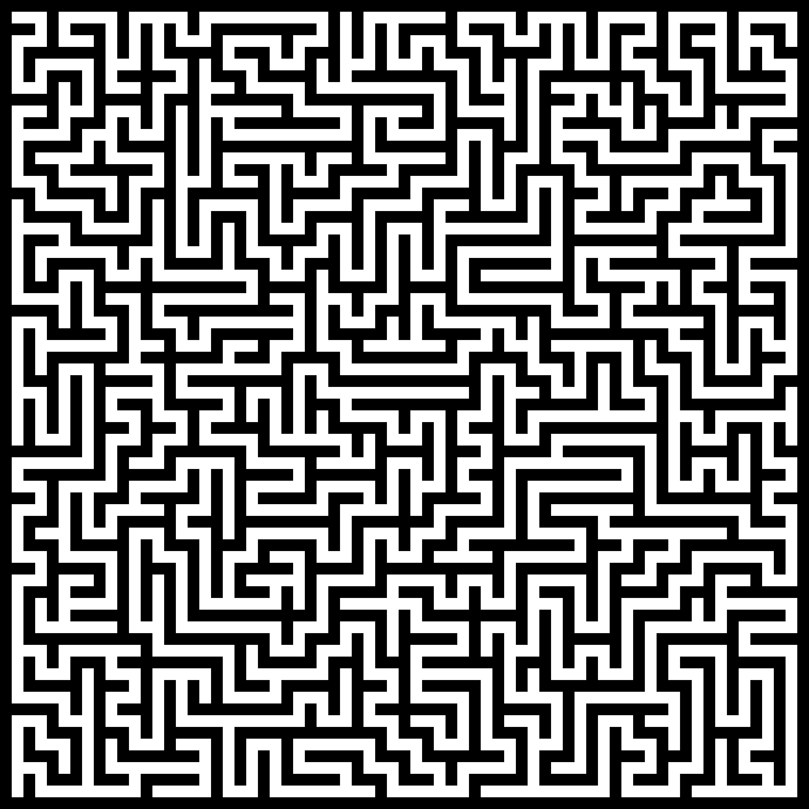

# Labyrinth Generator

### Description

* The program uses a recursive approach to randomly build a tree on a ```ROWS```x```COLUMNS``` plan.
* ```ROWS``` and ```COLUMNS``` are both constants declared in [constants.h](/src/constants.h).
* Make sure you use c++17 or later.

### I/O

* By default, the program prints the labyrinth to stdout.
* this setting can be easily modified in the [main](/src/main.cpp) defining ```OUTPUT_FILE``` and uncommenting "```freopen(OUTPUT_FILE, "w", stdout);```" (line 14).

### Example:


